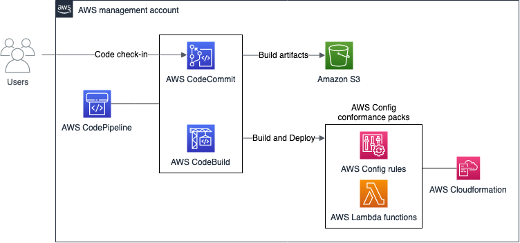

# Using AWS CodePipeline to deploy AWS Config conformance packs created with the Rule Development Kit

This project allows you to build, test, and deploy AWS Config rules at scale across multiple AWS accounts. We use AWS Config [conformance packs](https://docs.aws.amazon.com/config/latest/developerguide/conformance-packs.html), the [Rule Development Kit](https://github.com/awslabs/aws-config-rdk) (RDK), [RDKlib](https://github.com/awslabs/aws-config-rdklib), and the AWS Developer Tools. The implementation packages AWS Config rules created with the RDK and RDKlib into an organization conformance pack template. CodeBuild deploys the template. This implementation also supports [sample conformance pack templates](https://docs.aws.amazon.com/config/latest/developerguide/conformancepack-sample-templates.html) provided by AWS.

For further information, see the blog post related to this repository.

## Overview



The implementation is an automated pipeline that uses CodeCommit to host the code for AWS Config custom rules. The code was created using the RDK and conformance pack template files in YAML format. CodeBuild deploys AWS Lambda functions for the AWS Config custom rules. It packages the rules into a conformance pack template. CodeBuild deploys all conformance pack templates located at the root level of the CodeCommit repository, including the ones created using the RDK. CodePipeline automatically releases changes made to the content stored in the CodeCommit repository.

## How it Works

1. Users check-in their code in the AWS CodeCommit repository. The code can be AWS Config rules built using the RDK or AWS Config conformance packs template files in YAML format.
2. AWS CodePipeline triggers the CI/CD pipeline.
3. AWS CodeBuild deploys AWS Lambda functions used in AWS Config custom rules.
4. AWS CodeBuild creates a custom AWS Config conformance pack template file in YAML format.
5. AWS CodeBuild deploys AWS Config conformance packs template files in YAML format.
6. AWS CodeBuild deployment actions trigger AWS CloudFormation stacks deployments to create AWS Config conformance packs.

## Prerequisites
Before you begin: 
1.	Install the AWS CLI. For instructions, see [Installing the AWS CLI](https://docs.aws.amazon.com/cli/latest/userguide/cli-chap-install.html) in the AWS Command Line Interface User Guide.
2.	Complete the prerequisites in the [Deploy Conformance Packs Across an Organization with Automatic Remediation](https://aws.amazon.com/blogs/mt/deploying-conformance-packs-across-an-organization-with-automatic-remediation/) blog post.
3.	Install the RDK and RDKlib locally
```
# Using pip
pip install rdk 
pip install rdklib
```
4.	In the management account, install the RDKlib layer from the AWS Serverless Repository as described in the “Install the RDKlib layer” section of the [AWS Config Rule Development Kit library: Build and operate rules at scale](https://aws.amazon.com/blogs/mt/aws-config-rule-development-kit-library-build-and-operate-rules-at-scale/) blog post. Make a note of the ARN of the deployed layer. You will use it later in this post.
5.	(Optional) If you want to deploy and manage conformance packs from an AWS Organizations non-management account, follow the instructions in the [Deploy AWS Config rules and conformance packs using a delegated admin](https://aws.amazon.com/blogs/mt/deploy-aws-config-rules-and-conformance-packs-using-a-delegated-admin/) blog post.
6.	In the management account, make a note of the root ID for the organization. It starts with `r-` and can be found using the console or AWS CLI.
    *	In the AWS Organizations console, choose the **Organize accounts** tab. In the left pane, choose **Root**, and from the right pane, look under **ARN**.
    *	Use the following AWS CLI command:
```
aws organizations list-roots | jq -r ".Roots[0].Arn"
# arn:aws:organizations::123456789012:root/o-8snfo67u2v/r-i2ey
```
## Deployment

Our example uses AWS region `eu-west-1`. To deploy the implementation there:
1. Clone the respository
```
git clone https://github.com/aws-samples/aws-config-conformance-packs-pipeline
```
2. Move to the repository's directory
```
cd aws-config-conformance-packs-pipeline
```

3. Create an IAM role for the Lambda function to verify rule compliance on every account. For simplicity, we included a CloudFormation template (`rdk-role.yml`) that can be deployed as a stackset on all the accounts that you want to monitor. To deploy the stackset using the method described in this post, enable trusted access with AWS Organizations for AWS CloudFormation StackSets. You can also deploy the stackset using self-managed permissions, but you will need to adapt the following commands accordingly.
   * Set up your AWS credentials. Replace `<ManagementAccountId>` with the ID of your management account and `<OrganizationalUnitId>` with the value from step 6 in the “Prerequisites” section.
```
# Deploy the IAM role used by the RDK Lambda function
aws cloudformation create-stack-set --stack-set-name RDKLambdaRole --template-body file://rdk-role.yml --parameters ParameterKey=LambdaAccountId,ParameterValue=<ManagementAccountId> --capabilities CAPABILITY_NAMED_IAM --permission-model SERVICE_MANAGED --auto-deployment Enabled=true,RetainStacksOnAccountRemoval=false

aws cloudformation create-stack-instances --stack-set-name RDKLambdaRole --regions eu-west-1 --deployment-targets OrganizationalUnitIds=<OrganizationalUnitId>
```
4. Deploy the pipeline. For `<RDKlibLayerArn>`, use the value from step 4 of the “Prerequisites” section.
```
aws cloudformation deploy --template-file cfn-template.yml --stack-name org-conformance-packs-pipeline --parameter-overrides RDKlibLayerArn=<RDKlibLayerArn> --capabilities CAPABILITY_NAMED_IAM
```

## Usage
To use the implementation to deploy AWS Config custom rules created using the RDK or conformance pack templates: 
1.	In your local machine, move to the repository’s directory.
2.	Create an AWS Config custom rule or copy an existing one from the AWS Config rules repository.
      * For a periodic trigger:
        ```
        # Replace <maximum frequency> with your desired frequency
        rdk create YOUR_RULE_NAME –-runtime python3.6-lib --maximum-frequency <maximum frequency>
        ```
      * For a configuration change trigger:
        ```
        # Replace <resource type> with your desired resource type
        rdk create YOUR_RULE_NAME --runtime python3.6-lib --resource-types <resource_type>
        ```
3.	Add the name of the IAM role you created using the stackset to the parameters.json file in the rule directory. The Lambda function assumes this role to verify that the resources on the target account are compliant. See `InputParameters` below.
```
{
  "Version": "1.0",
  "Parameters": {
    "RuleName": "test_rule",
    "Description": "test_rule",
    "SourceRuntime": "python3.6-lib",
    "CodeKey": "test_rule.zip",
    "InputParameters": "{\"ExecutionRoleName\": \"AWSRDKLambdaRole\"}",
    "OptionalParameters": "{}",
    "SourceEvents": "AWS::EC2::Instance"
  },
  "Tags": "[]"
}
```
4.	Push your code to the remote CodeCommit repository.

There are two stages in the CodePipeline pipeline: a CodeCommit source stage and CodeBuild build stage. The source stage is triggered whenever code is pushed to the CodeCommit repository. The build stage copies the code to an S3 staging bucket using CodeBuild. The build stage is defined in a `buildspec.yaml` file that uses the AWS CLI to:
•	Set up the RDK in the build environment.
•	Deploy Lambda functions for AWS Config custom rules created using the RDK.
•	Create a conformance pack template file named custom-conforms-pack-template.yaml.
•	Deploy conformance pack templates using the aws configservice put-organization-conformance-pack command.

You have now deployed the AWS Config conformance packs. You should be able to see them on the **Conformance Packs** page in the AWS Config console.

## Cleanup
To avoid incurring additional charges in your account, run the following commands in the management account or the delegated admin account to remove the resources you created:
```
# Delete all conformance packs deployed
aws configservice delete-organization-conformance-pack
--organization-conformance-pack-name <value>

# Delete all objects created in the S3 bucket used to store CodePipeline artifacts
aws s3 rm s3://<bucket_name>/ --recursive

# Delete the AWS CloudFormation stack
aws cloudformation delete-stack --stack-name org-conformance-packs-pipeline
```

Delete the resources you created as prerequisites for [deploying conformance packs across an organization](https://aws.amazon.com/blogs/mt/deploying-conformance-packs-across-an-organization-with-automatic-remediation/).

## Security
See [CONTRIBUTING](CONTRIBUTING.md#security-issue-notifications) for more information.

## License
This library is licensed under the MIT-0 License. See the LICENSE file.


